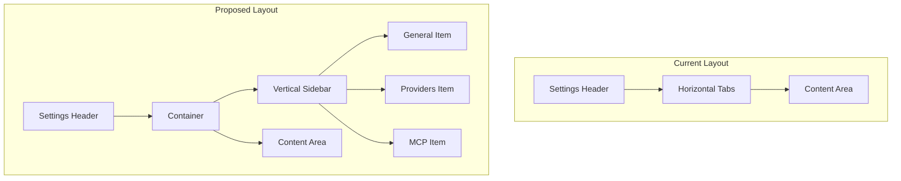

# Settings Vertical Sidebar Navigation Redesign

## Overview

Redesign the settings tabs from a horizontal layout to a vertical sidebar navigation menu with intuitive icons and text labels. This will optimize the layout for vertical alignment, maximize screen real estate, and improve the visual hierarchy of the interface.

## Current Implementation Analysis

### Current Structure

The settings view currently has:
- **Horizontal tabs** at the top of the settings content area
- **Three tabs**: General, Providers, MCP Servers
- **Simple button-based tabs** with text-only labels
- **Active state** indicated by bottom border

### Files Involved

| File | Purpose |
|------|---------|
| [`src/webview/panel.ts`](src/webview/panel.ts:2717) | HTML structure for settings view |
| [`src/webview/ui/styles.css`](src/webview/ui/styles.css:1919) | CSS styles for tabs |
| [`src/webview/ui/main.js`](src/webview/ui/main.js:130) | JavaScript tab switching logic |

### Current HTML Structure

```html
<div id="settings-view" class="hidden">
  <div id="settings-header">...</div>
  <div id="settings-tabs">
    <button id="tab-general" class="tab-btn active">General</button>
    <button id="tab-providers" class="tab-btn">Providers</button>
    <button id="tab-mcp" class="tab-btn">MCP Servers</button>
  </div>
  <div id="settings-content">
    <div id="general-panel">...</div>
    <div id="providers-panel" class="hidden">...</div>
    <div id="mcp-panel" class="hidden">...</div>
  </div>
</div>
```

## Proposed Design

### Layout Structure

```
┌─────────────────────────────────────────────────┐
│  ← Settings                                     │
├────────────┬────────────────────────────────────┤
│            │                                    │
│  ⚙ General │   [General Settings Content]       │
│            │                                    │
│  🔌 Provide│   [OR Providers Content]           │
│            │                                    │
│  🔗 MCP    │   [OR MCP Servers Content]         │
│            │                                    │
└────────────┴────────────────────────────────────┘
```

### Visual Design Specifications

#### Sidebar Dimensions
- **Width**: 48-56px (icon-only) or 140-160px (with text labels)
- **Background**: Slightly darker/lighter than content area
- **Border**: Right border to separate from content

#### Navigation Items
- **Height**: 40-44px per item
- **Padding**: 8-12px
- **Icon Size**: 20px
- **Active State**: Left border accent + background highlight

#### Icons (using Unicode/CSS)
| Tab | Icon | Unicode |
|-----|------|---------|
| General | ⚙️ Gear | `\2699` or SVG |
| Providers | 🔌 Plug | `\1F50C` or SVG |
| MCP Servers | 🔗 Link | `\1F517` or SVG |

### Proposed HTML Structure

```html
<div id="settings-view" class="hidden">
  <div id="settings-header">...</div>
  <div class="settings-container">
    <nav id="settings-sidebar">
      <button class="sidebar-item active" data-tab="general">
        <span class="sidebar-icon">⚙</span>
        <span class="sidebar-label">General</span>
      </button>
      <button class="sidebar-item" data-tab="providers">
        <span class="sidebar-icon">🔌</span>
        <span class="sidebar-label">Providers</span>
      </button>
      <button class="sidebar-item" data-tab="mcp">
        <span class="sidebar-icon">🔗</span>
        <span class="sidebar-label">MCP Servers</span>
      </button>
    </nav>
    <div id="settings-content">
      <div id="general-panel">...</div>
      <div id="providers-panel" class="hidden">...</div>
      <div id="mcp-panel" class="hidden">...</div>
    </div>
  </div>
</div>
```

## Implementation Plan

### Step 1: Update HTML Structure in panel.ts

**File**: [`src/webview/panel.ts`](src/webview/panel.ts:2711)

**Changes**:
1. Replace `#settings-tabs` div with `#settings-sidebar` nav element
2. Wrap sidebar and content in a `.settings-container` flex container
3. Update tab buttons to use `.sidebar-item` class with icon and label spans
4. Add `data-tab` attributes for easier tab switching

### Step 2: Add CSS Styles in styles.css

**File**: [`src/webview/ui/styles.css`](src/webview/ui/styles.css:1919)

**New Styles Needed**:

```css
/* Settings Container - Flex layout */
.settings-container {
  display: flex;
  flex: 1;
  overflow: hidden;
}

/* Vertical Sidebar Navigation */
#settings-sidebar {
  display: flex;
  flex-direction: column;
  width: 150px;
  min-width: 150px;
  background: var(--vscode-sideBar-background);
  border-right: 1px solid var(--vscode-panel-border);
  padding: 8px 0;
}

/* Sidebar Navigation Items */
.sidebar-item {
  display: flex;
  align-items: center;
  gap: 8px;
  padding: 10px 12px;
  background: none;
  border: none;
  border-left: 2px solid transparent;
  color: var(--vscode-foreground);
  cursor: pointer;
  font-size: var(--vscode-font-size);
  text-align: left;
  width: 100%;
  opacity: 0.8;
  transition: opacity 0.15s, background 0.15s, border-color 0.15s;
}

.sidebar-item:hover {
  opacity: 1;
  background: var(--vscode-list-hoverBackground);
}

.sidebar-item.active {
  opacity: 1;
  background: var(--vscode-list-activeSelectionBackground);
  border-left-color: var(--vscode-focusBorder);
  color: var(--vscode-list-activeSelectionForeground);
}

/* Sidebar Icons */
.sidebar-icon {
  font-size: 16px;
  width: 20px;
  text-align: center;
  flex-shrink: 0;
}

/* Sidebar Labels */
.sidebar-label {
  white-space: nowrap;
  overflow: hidden;
  text-overflow: ellipsis;
}

/* Adjust settings content to fill remaining space */
#settings-content {
  flex: 1;
  overflow-y: auto;
  padding: 16px;
}
```

### Step 3: Update JavaScript Tab Switching in main.js

**File**: [`src/webview/ui/main.js`](src/webview/ui/main.js:525)

**Changes**:
1. Update element references from `tabProviders`, `tabMcp`, `tabGeneral` to use `querySelectorAll('.sidebar-item')`
2. Implement event delegation on `#settings-sidebar`
3. Use `data-tab` attribute for panel identification

**New JavaScript Logic**:

```javascript
// Settings sidebar navigation
const settingsSidebar = document.getElementById('settings-sidebar');
const sidebarItems = settingsSidebar.querySelectorAll('.sidebar-item');

settingsSidebar.addEventListener('click', (e) => {
  const item = e.target.closest('.sidebar-item');
  if (!item) return;
  
  const tabId = item.dataset.tab;
  
  // Update active states
  sidebarItems.forEach(i => i.classList.remove('active'));
  item.classList.add('active');
  
  // Show/hide panels
  document.getElementById('general-panel').classList.toggle('hidden', tabId !== 'general');
  document.getElementById('providers-panel').classList.toggle('hidden', tabId !== 'providers');
  document.getElementById('mcp-panel').classList.toggle('hidden', tabId !== 'mcp');
});
```

### Step 4: Remove Old Tab Styles

Remove or comment out the old `#settings-tabs` and `.tab-btn` styles that are no longer needed.

## Visual Hierarchy Improvements

1. **Clear Navigation**: Vertical sidebar provides a clear, scannable list of settings categories
2. **Icon Recognition**: Icons provide quick visual identification of each settings section
3. **Active State**: Left border accent clearly indicates current section
4. **Consistent Spacing**: Uniform item heights create visual rhythm
5. **Content Focus**: Sidebar separation allows content area to use maximum available space

## Accessibility Considerations

1. **Keyboard Navigation**: Ensure Tab key navigates between sidebar items
2. **Focus Indicators**: Visible focus outline on sidebar items
3. **ARIA Labels**: Add `role="navigation"` and `aria-label` to sidebar
4. **Screen Reader**: Add `aria-current="page"` to active item

## Responsive Considerations

For narrower viewports, consider:
- Collapsible sidebar with icon-only mode
- Hamburger menu to toggle sidebar visibility
- Minimum width threshold to switch to horizontal tabs

## Mermaid Diagram



## Testing Checklist

- [ ] All three tabs navigate correctly
- [ ] Active state displays properly
- [ ] Hover states work
- [ ] Keyboard navigation works
- [ ] Icons render correctly
- [ ] Layout is responsive
- [ ] No visual regressions in content panels
- [ ] Extension compiles without errors
- [ ] Extension runs in VS Code

## Files to Modify

| File | Lines | Changes |
|------|-------|---------|
| `src/webview/panel.ts` | 2717-2770 | Replace horizontal tabs with vertical sidebar HTML |
| `src/webview/ui/styles.css` | 1919-1945 | Replace tab styles with sidebar styles |
| `src/webview/ui/main.js` | 130-134, 525-555 | Update tab switching logic |
